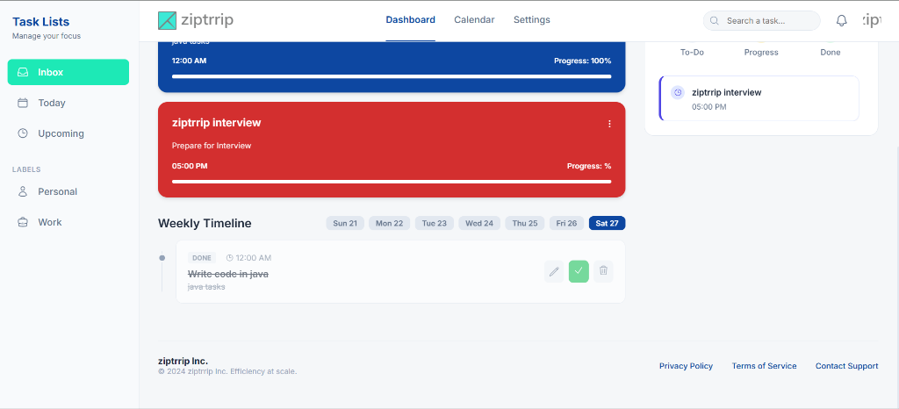
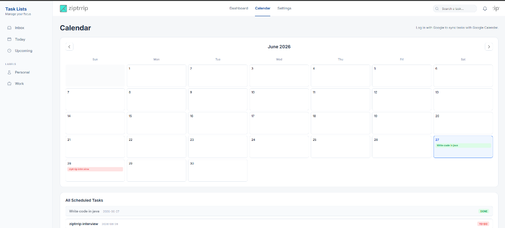
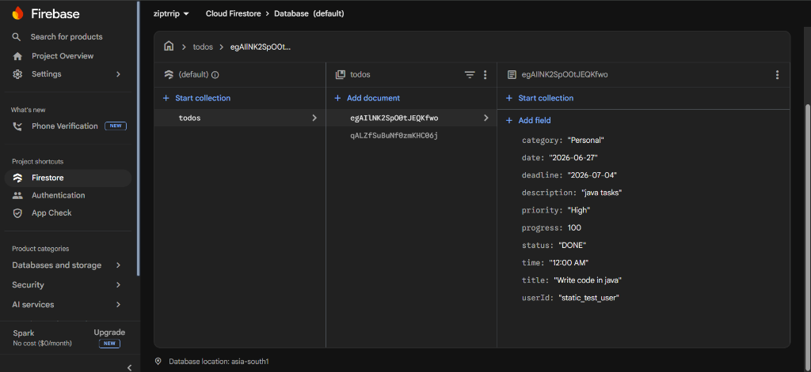
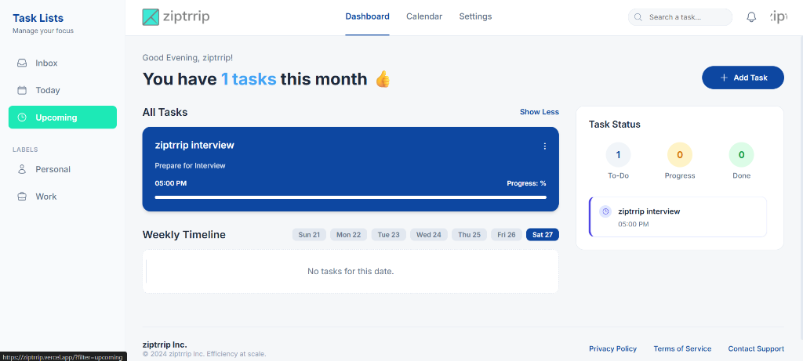
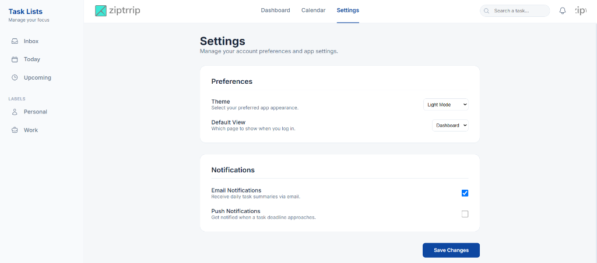
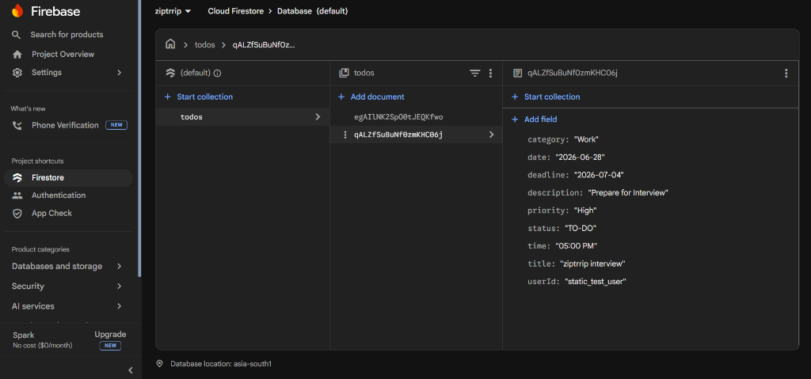

LIVE LINK : https://ziptrrip.vercel.app/
USERNAME: test
PASSWORD: test123
# ziptrrip - Task Management Dashboard

**ziptrrip** is a modern, responsive task management application built with React and Vite. It helps you stay on top of your workflow by organizing tasks, categorizing them, and keeping everything in sync with your Google Calendar.

## 📸 Screenshots

<div style="display: grid; grid-template-columns: repeat(2, 1fr); gap: 10px;">
  
  
  
  
  
  
</div>

## ✨ Features

- **Intuitive Dashboard:** Easily view, create, edit, and delete tasks.
- **Smart Filtering:** Filter your tasks by status (To-Do, In Progress, Done), category (Personal, Work), and time (Today, Upcoming).
- **Weekly Timeline View:** A visual calendar strip to see tasks scheduled for specific days of the week.
- **Google Calendar Integration:** Automatically sync your tasks to your primary Google Calendar when you log in via Google.
- **Real-time Cloud Storage:** Powered by Firebase Firestore, ensuring your tasks are securely saved and synced in the cloud scoped perfectly to your user account.
- **Modern UI/UX:** Clean aesthetics, modern elements, and smooth micro-animations.

## 🚀 Getting Started (Local Development)

The application uses a React frontend and connects directly to a Firebase project for authentication and database storage.

### Prerequisites
- Node.js installed on your machine.
- A Firebase project configured (See `FIREBASE_SETUP.md` for full instructions).

### 1. Installation

Clone the repository and install the dependencies for the frontend:

```bash
cd frontend
npm install
```

*(Note: The `backend/` folder is deprecated as the app now communicates directly with Firebase Firestore.)*

### 2. Environment Variables

Create a `.env` file in the `frontend/` directory and add your Firebase configuration keys:

```env
VITE_FIREBASE_API_KEY=your_api_key_here
VITE_FIREBASE_AUTH_DOMAIN=your_project.firebaseapp.com
VITE_FIREBASE_PROJECT_ID=your_project_id
VITE_FIREBASE_STORAGE_BUCKET=your_project.appspot.com
VITE_FIREBASE_MESSAGING_SENDER_ID=your_sender_id
VITE_FIREBASE_APP_ID=your_app_id
```

### 3. Run the App

Start the Vite development server:

```bash
npm run dev
```

Open [http://localhost:5173](http://localhost:5173) in your browser. 
You can use the "Continue with Google" button for the full experience (including Calendar Sync) or use the static login credentials (`test` / `test123`) for quick offline testing.

## 🌐 Deployment

ziptrrip is fully optimized to be deployed on platforms like **Vercel**. Simply import the `frontend` folder as your root directory in Vercel and ensure you copy over your Environment Variables into the Vercel dashboard.

---
*Built with ❤️ for efficiency at scale.*
